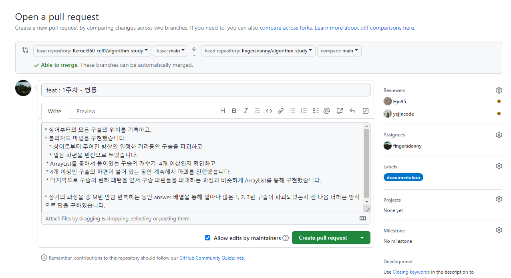

# PR 규칙

본 스터디에서는 아래 규칙을 따라서 pull request를 보내 주시길 바랍니다.

## 목차
* [디렉토리](#디렉토리)
* [파일명 및 commit, pr 메세지](#파일명-및-commit-pr-메세지)
* [pull request](#pull-request)
* [README 수정](#readme-수정)

## 디렉토리
아래와 같이 각 멤버마다 폴더를 하나씩 만들어 놓고 사용합니다.


모든 파일은 해당 멤버의 디렉토리에 추가 후 commit 및 pr을 통해 반영됩니다.  


사용자 폴더 내에서는 추가 폴더를 마음껏 생성해도 됩니다.

## 파일명 및 commit, pr 메세지

파일 명은 다음과 같은 형식을 사용합니다.

* 파일 명: 플랫폼_문제이름.java
* 파일 예시:

```
    BOJ_마법사상어와블리자드.java
    PGS_두큐합같게만들기.py
```

* 플랫폼 작성법 통일:
  * [BOJ] - [백준](https://www.acmicpc.net/)
  * [LTC] - [Leetcode](https://leetcode.com/)
  * [PGS] - [프로그래머스](https://programmers.co.kr/)
  * [ETC] - 그외
  * 플랫폼 작성법은 추후 요청을 통해 추가 및 삭제할 수 있습니다.
* 커밋 메세지 : 파일명에서 확장자명을 제거
```
    BOJ_마법사상어와블리자드
```

* PR 요청 메세지: feat: n주차 - 이름

```
   feat : 1주차 - 병룡
```

## pull request
새로운 만든 branch에서 수정을 하고 나면 GitHub에서 다음과 같이 fork한 저장소에서 원본 저장소로 pr을 보낼 수 있습니다.



옆에 ``Reviewers``에 자신의 담당 팀원에 해당하는 사람을 지정하고 ``Assignees``에 자신을 지정합니다. 

## README 수정
[문제목록](../README.md)에서 해당 주차에 있는 빈칸에 자신이 풀었던 문제이름을 작성하시면 됩니다.